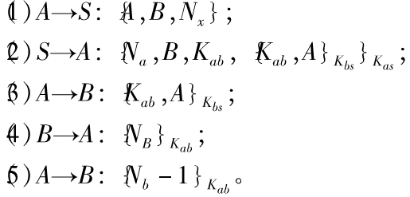

# NSSK协议认证流程与原理

### 若A和B想要进行通信，就要加入一个可信的第三方服务器。 流程：

1. A向服务器S发送自己和要通信目标的标识和一个随机数Na
2. 然后服务器S返回给A一个A和S对称密钥加密的内容，包括：随机数Na、目标B的标识、AB的会话密钥和用服务器和B的对称密钥加密的内容，其中包括：AB的会话密钥，和A的标识。
3. A用和服务器共同的对称密钥解密出结果后，判断随机数Na是否正确，正确后向B发送用服务器和B的对称密钥加密的内容，其中包括：AB的会话密钥，和A的标识。
4. B用和服务器共同的对称密钥解密出结果后，用AB的会话密钥加密一个随机数Nb。
5. A收到解密后将这个随机数-1后重新发送给B，B解密后若正确，则A和B的保密通信即可建立。
> 和服务器的通信由于需要加密的数据量小，可以采用RSA来实现。A和B之间通信的数据量较大，可以采用AES实现。
