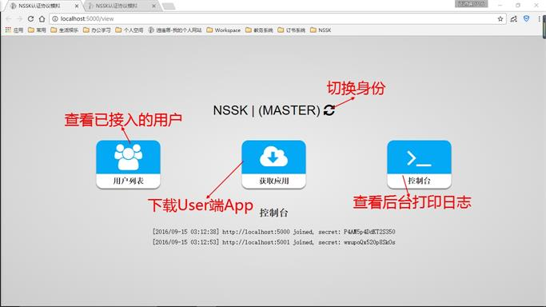
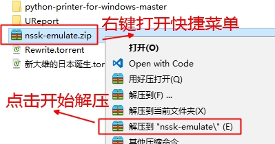
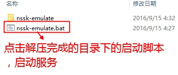
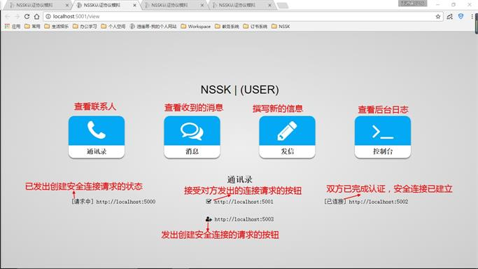
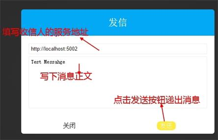

# nssk-emulate
# NSSK协议模拟

***
## 功能规格
1. Master端提供User端之间的接入与认证，提供app的下载
2. User端可以发起或接受创建安全加密连接的请求
3. 遵循NSSK协议建立安全连接，展示认证流程
4. User之间安全连接建立后可以相互以密文通讯
5. 通讯内容采用AES对称加密，解密后展示在前端
6. Master同时也具有User身份，User也可以与自己建立连接并通讯
7. 基于上一条原理，S、A、B三端可以分别部署，也可部署在同一个节点演示
8. User可以作为其他User的Master，彼Master地址指向此通讯地址

***
## 技术规格
1. 客户端以网页形式展现，由前端Web页面+后端本地Server组成
2. 前端Web页面基于H5CSS3，引入`Jquery`，通过`Ajax`调用起后端服务
2. 后端Server基于`Macaron`框架，提供前端接口，收发各个角色间的通讯
3. NSSK协议中对称加密采用AES算法，16位密钥，基于Go官方标准库`"crypto/aes"`

***
## 附件1 * 名词解释：
- Master: 作为中央公信服务器的一台PC|Server或一个端口
- User: 多台PC|Server或同一PC|Server多端口
- S：NSSK认证协议中充当中间服务器的角色
- A: NSSK认证协议中发起建立连接请求，接受连接验证的角色
- B: NSSK认证协议中接受安全连接请求，发起连接验证的角色

***
## 使用文档
### 首先要部署一个Master端app
- 对于简单情况（同一台机器模拟S、A、B），直接双击主程序（`nssk-emulate.exe`），应用将作为Master启动，监听`http://localhost:5000`地址上
- 对于多机器间模拟的场景，通过启动时命令行传参来指定本机服务地址以及Master地址。例如：`nssk-emulate -host 192.168.1.101 -master http://192.168.1.101:5000`



### 点击中央按钮获取并启动User端App
- 您将会得到一个zip压缩包，将其解压后双击启动脚本`nssk-emulate.bat`，app将以User模式启动
- 以这种方式启动的app，其通许地址将视为访问下载时的地址，其Master将默认视为提供下载的服务端
- 您也可以通过命令行传参来手动指定启动模式及服务指向关系，启动脚本与主程序都支持同样的参数



### 创建User之间的安全加密连接
1. A从联系人中选定一位用户B并点击创建连接按钮
2. B收到A的连接请求，从通讯录中找到A并点击接受连接的按钮
3. 安全连接创建完成，可以依次查看A、B、S的控制台日志



### User之间通过安全连接使用密文通讯
1. 用户A点击第三个按钮，弹出编写信息弹框，填写并发送
2. 用户B点击第二个按钮，查看A发来的消息




## 附件1 * 基本命令：
``` bat
Usage of nssk-emulate:
  -host string
        指定主机IP或域名 (default "localhost")
  -master string
        指定公信服务主机通讯地址
         * 当公信服务地址与本机服务地址相同时
         * (master == http://address:port)
         * 应用将作为公信服务端启动
        (default "http://localhost:5000")
  -port int
        指定端口号（-1表示自动检索） (default -1)
  -s string
        信号 run | scan (default "run")

```

***
## 附件2 * NSSK协议认证流程与原理
### 若A和B想要进行通信，就要加入一个可信的第三方服务器。 流程：

1. A向服务器S发送自己和要通信目标的标识和一个随机数Na
2. 然后服务器S返回给A一个A和S对称密钥加密的内容，包括：随机数Na、目标B的标识、AB的会话密钥和用服务器和B的对称密钥加密的内容，其中包括：AB的会话密钥，和A的标识。
3. A用和服务器共同的对称密钥解密出结果后，判断随机数Na是否正确，正确后向B发送用服务器和B的对称密钥加密的内容，其中包括：AB的会话密钥，和A的标识。
4. B用和服务器共同的对称密钥解密出结果后，用AB的会话密钥加密一个随机数Nb。
5. A收到解密后将这个随机数-1后重新发送给B，B解密后若正确，则A和B的保密通信即可建立。
> 和服务器的通信由于需要加密的数据量小，可以采用RSA来实现。A和B之间通信的数据量较大，可以采用AES实现。

